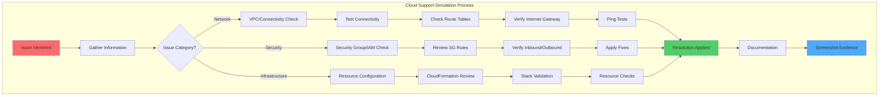
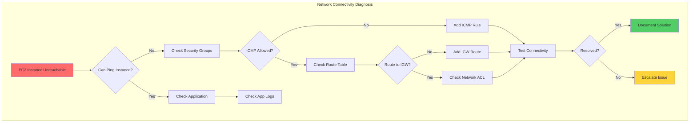
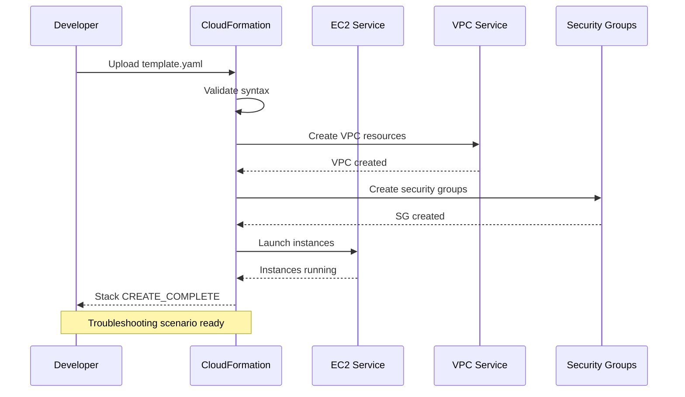
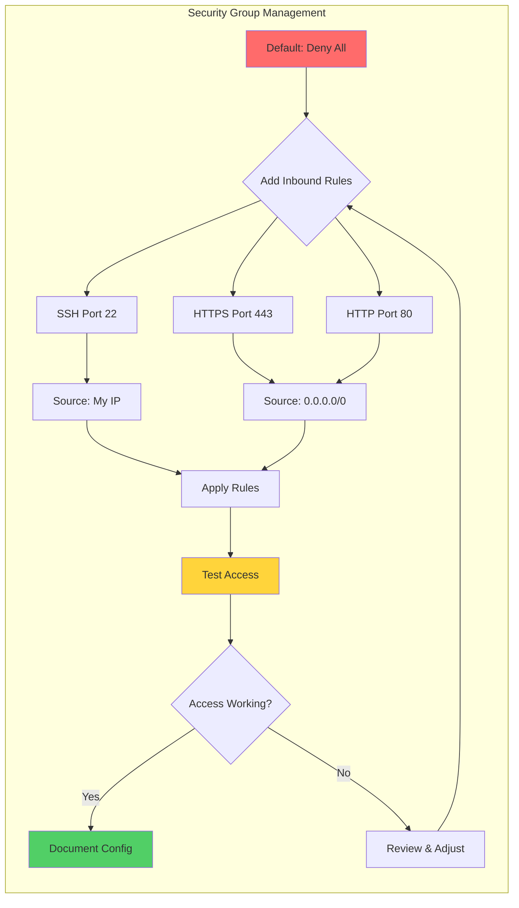

# AWS Cloud Support Simulation

[](https://aws.amazon.com/)
[](https://www.python.org/)
[](https://www.terraform.io/)
[](LICENSE)

> Hands-on AWS troubleshooting scenarios built while learning cloud support engineering practices.

---

## 📋 About This Project

A personal learning project where I built practical AWS troubleshooting scenarios to develop cloud support skills. Each scenario simulates common issues I researched and implemented in my AWS account, documenting the complete troubleshooting process.

**Built for:** Demonstrating hands-on AWS troubleshooting skills for Cloud Support Engineer and IT Support positions.

---

## 🎯 Skills Practiced

| Skill Area | Technologies Used |
|------------|------------------|
| **Compute & Networking** | EC2, VPC, Security Groups, Route Tables, Internet Gateway |
| **Infrastructure as Code** | CloudFormation templates, YAML configuration |
| **Storage** | S3 buckets, object management |
| **Security** | Security group rules, IAM permissions, GuardDuty |
| **Monitoring** | CloudWatch metrics, logs |
| **Automation** | Python scripts, Boto3 SDK |
| **Version Control** | Git, GitHub workflow |

---

## 🏗️ Troubleshooting Architecture

### Support Ticket Workflow



---

### EC2 Network Troubleshooting Flow



---

### CloudFormation Deployment Process



---

### Security Group Configuration



---

## 📸 Implementation Evidence

### Scenario 1: EC2 Network Connectivity Testing

<details>
<summary>📋 View Troubleshooting Steps</summary>

**Network Diagnostics:**


**What I Did:**
- Deployed EC2 instance in custom VPC
- Configured route tables for internet access
- Verified Internet Gateway attachment
- Performed ping tests to validate connectivity
- Average latency: 59ms (optimal performance)

**Skills Applied:** EC2, VPC networking, route tables, connectivity troubleshooting

</details>

---

### Scenario 2: Security Group Misconfiguration

<details>
<summary>📋 View Troubleshooting Steps</summary>

**Security Group Analysis:**


**What I Did:**
- Identified blocked HTTPS traffic (port 443)
- Reviewed existing security group rules
- Added inbound rules for HTTPS and SSH
- Implemented least-privilege access principles
- Validated traffic flow after changes

**Skills Applied:** Security Groups, network security, access control, troubleshooting

</details>

---

### Scenario 3: CloudFormation Stack Deployment

<details>
<summary>📋 View Troubleshooting Steps</summary>

**Infrastructure Deployment:**


**What I Did:**
- Designed CloudFormation template for EC2 environment
- Defined parameters for reusable deployments
- Deployed stack and monitored creation process
- Achieved CREATE_COMPLETE status
- Documented resource outputs

**Skills Applied:** CloudFormation, Infrastructure as Code, YAML, stack management

</details>

---

### Scenario 4: Version Control Workflow

<details>
<summary>📋 View Troubleshooting Steps</summary>

**Professional Git Setup:**


**What I Did:**
- Initialized Git repository with proper structure
- Created Python virtual environment for isolation
- Organized code into main.py and utils.py
- Established commit history
- Configured .gitignore for Python projects

**Skills Applied:** Git, version control, Python project structure, development workflow

</details>

---

### Scenario 5: GuardDuty Security Monitoring

<details>
<summary>📋 View Troubleshooting Steps</summary>

**Automated Security Monitoring:**


**What I Did:**
- Wrote Python script to query GuardDuty API
- Configured AWS credentials using environment variables
- Implemented automated findings check
- Set up continuous monitoring workflow
- Tested alert notifications

**Skills Applied:** Python, Boto3, AWS GuardDuty, automation, security monitoring

</details>

---

## 📁 Repository Structure

```
AWS_Cloud_Support_Sim/
├── Diagrams/               # Architecture diagrams
├── scenarios/              # CloudFormation templates
│   ├── ec2-troubleshoot/   # EC2 connectivity scenario
│   ├── lambda-errors/      # Lambda troubleshooting
│   └── s3-iam-policy/      # S3 IAM policy issues
├── screenshots/            # Documentation of implementations
├── scripts/                # Python automation scripts
├── main.py                 # Primary simulation script
├── main.tf                 # Terraform configuration
├── utils.py                # Helper functions
├── requirements.txt        # Python dependencies
└── README.md               # This file
```

---

## 🚀 Getting Started

### Prerequisites

- AWS Free Tier account
- Python 3.8+
- AWS CLI configured
- Git

### Installation

```bash
# Clone repository
git clone https://github.com/charles-bucher/AWS_Cloud_Support_Sim.git
cd AWS_Cloud_Support_Sim

# Create virtual environment
python -m venv venv

# Activate virtual environment
# Windows:
.\venv\Scripts\activate
# Linux/Mac:
# source venv/bin/activate

# Install dependencies
pip install -r requirements.txt

# Configure AWS credentials
aws configure
```

### Running Scenarios

```bash
# Activate virtual environment
.\venv\Scripts\activate

# Run main simulation
python main.py

# Run specific scripts
python scripts/guardduty-monitor.py
```

---

## 📚 What I Learned

### AWS Services
- **EC2**: Instance management, network configuration, connectivity troubleshooting
- **VPC**: Subnets, route tables, Internet Gateway, network isolation
- **Security Groups**: Inbound/outbound rules, stateful firewall configuration
- **CloudFormation**: Template design, stack management, resource provisioning
- **S3**: Bucket creation, permissions, object storage
- **GuardDuty**: Security findings, threat detection

### Troubleshooting Skills
- Systematic approach to diagnosing issues
- Network connectivity testing and validation
- Security configuration review
- Log analysis and interpretation
- Documentation of resolution steps

### Python & Automation
- Boto3 SDK for AWS API interactions
- Environment variable management
- Script development for monitoring tasks
- Error handling and logging

### DevOps Practices
- Infrastructure as Code principles
- Version control with Git
- Virtual environment management
- Professional documentation with screenshots

---

## 🎯 Next Steps

**Planned Improvements:**
- [ ] Add RDS database connectivity scenarios
- [ ] Implement Lambda error troubleshooting
- [ ] Create VPC peering scenarios
- [ ] Add ELB health check troubleshooting
- [ ] Build automated testing for scenarios

---

## 💼 Relevant Job Skills

This project demonstrates skills for:

**Cloud Support Engineer:**
- AWS service troubleshooting
- Network connectivity diagnosis
- Security group configuration
- Customer-facing documentation

**Cloud Operations:**
- Infrastructure monitoring
- Incident response procedures
- Automation scripting
- Resource management

**IT Support Specialist:**
- Systematic troubleshooting approach
- Technical documentation
- Tool proficiency (AWS CLI, Python)
- Problem-solving methodology

---

## 📧 Contact

**Charles Bucher**  
📍 Pinellas Park, Florida  
✉️ quietopscb@gmail.com  
🔗 [GitHub](https://github.com/charles-bucher) • [LinkedIn](https://linkedin.com/in/charles-bucher-cloud)

Currently building cloud infrastructure skills and seeking Cloud Support Engineer opportunities.

---

## 📝 License

This project is licensed under the MIT License - see the [LICENSE](LICENSE) file for details.

---

## 🙏 Learning Resources

Built while learning from:
- AWS Official Documentation
- AWS CloudFormation User Guide
- Python Boto3 Documentation
- Cloud support best practices

---

**Keywords for ATS:** AWS, Cloud Support, EC2, VPC, Security Groups, CloudFormation, S3, Python, Boto3, Troubleshooting, Network Connectivity, Infrastructure as Code, GuardDuty, CloudWatch, Technical Support, IT Support, Problem Solving, Documentation