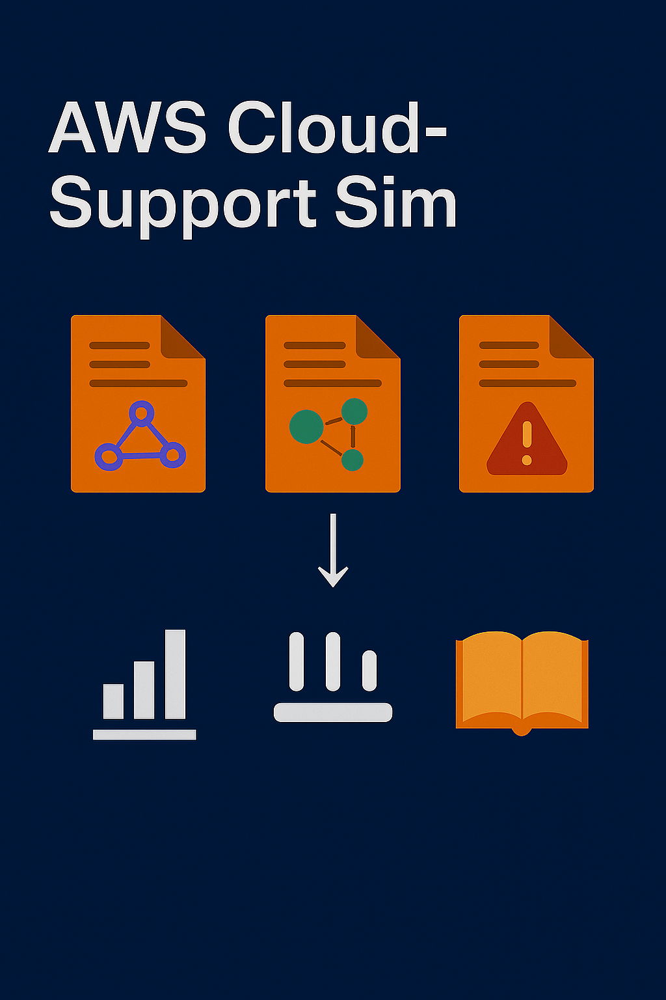

AWS Cloud Support Simulation 🛠️☁️

License: MIT | Tech: AWS, Python, Terraform

🚀 Why This Project Exists

This repository is a hands-on AWS Cloud Support lab designed to simulate real-world troubleshooting scenarios you would encounter as a Cloud Support Engineer, Technical Support Engineer, or CloudOps specialist.

Instead of just following tutorials, I built and broke AWS environments intentionally to practice diagnosing issues, applying fixes, and documenting solutions—mimicking actual cloud support work.

Purpose:

Showcase practical cloud support skills to hiring managers.

Provide reproducible troubleshooting scenarios for hands-on learning.

Build a professional portfolio to land remote, felon-friendly cloud support roles.

🎯 What I Learned

Through this project, I gained real-world, job-ready cloud skills:

AWS Services: EC2, VPC, Security Groups, S3, Lambda, GuardDuty, IAM, CloudFormation, CloudWatch
Networking & Security: VPC design, routing issues, subnet configs, NACLs, least-privilege IAM policies
Automation: Python + Boto3 for monitoring, detection, and remediation scripts
Infrastructure as Code: Terraform & CloudFormation deployments
DevOps Practices: Git workflows, version control, systematic troubleshooting, documentation
Problem-Solving: Root-cause analysis, security misconfigurations, connectivity failures

🏗️ Project Overview

Hands-on troubleshooting lab simulating eight realistic scenarios:

#	Scenario	What You Learn
1	VPC Network Setup	CIDR blocks, Internet Gateway, connectivity troubleshooting
2	Subnets & Route Tables	Public/private subnets, routing issues, network validation
3	Security Groups & NACLs	Firewall rules, connectivity, least-privilege enforcement
4	Git Version Control Workflow	Branching, merging, collaboration for infrastructure changes
5	Python/Boto3 GuardDuty Automation	Security event detection, remediation, CloudWatch integration
6	S3 Bucket Management	Access policies, troubleshooting permissions and encryption
7	IAM Roles & Policies	Role creation, permission issues, policy troubleshooting
8	CloudWatch Monitoring	Metrics, alarms, dashboards, and AWS service health checks

Each scenario is documented with step-by-step screenshots and diagrams so you can see troubleshooting in action, not just read about it.

⚡ Quick Start
# Clone repository
git clone https://github.com/charles-bucher/AWS_Cloud_Support_Sim.git
cd AWS_Cloud_Support_Sim

# Create virtual environment
python -m venv venv

# Activate environment (Windows)
.\venv\Scripts\activate

# Activate environment (Linux/Mac)
source venv/bin/activate

# Install dependencies
pip install -r requirements.txt

# Configure AWS CLI
aws configure

# Run simulation
python main.py

🛠️ Skills & Technologies
Category	Technologies
Cloud Platform	AWS (EC2, VPC, S3, IAM, Lambda, GuardDuty, CloudFormation)
Networking	VPC, Subnets, Route Tables, Security Groups, NACLs, Internet Gateway
Infrastructure as Code	Terraform, CloudFormation, YAML, HCL
Scripting & Automation	Python 3.8+, Boto3 SDK, AWS CLI
Monitoring & Logging	CloudWatch (metrics, alarms, logs)
Version Control	Git, GitHub
Security	IAM policies, Security Groups, GuardDuty, encryption
Problem Solving	Troubleshooting, root cause analysis, documentation
🎯 Target Roles

Cloud Support Engineer

CloudOps Engineer

Technical Support Engineer

Junior DevOps / NOC

Why this repo makes you attractive:

Demonstrates real troubleshooting instincts, not guesswork.

Shows automation and coding skills in Python & Terraform.

Provides visual documentation for hiring managers to quickly assess skill level.

📝 Next Steps / Improvements

RDS connectivity troubleshooting

Lambda error-handling scenarios

VPC Peering configuration

ELB health check troubleshooting

Auto Scaling scenarios

Cost optimization examples

🤝 Contributing

Contributions welcome! Please read CONTRIBUTING.md for guidelines.

📄 License

MIT License – see LICENSE file for details

🔐 Security

Please review SECURITY.md for reporting vulnerabilities

📧 Contact

Charles Bucher
📍 Pinellas Park, Florida
✉️ quietopscb@gmail.com

🔗 GitHub
 • LinkedIn

⭐ Why You Should Star This Repo

If you’re learning AWS, cloud support, or DevOps troubleshooting, this repo provides step-by-step real-world simulations with screenshots, diagrams, and automation scripts—all in one place.